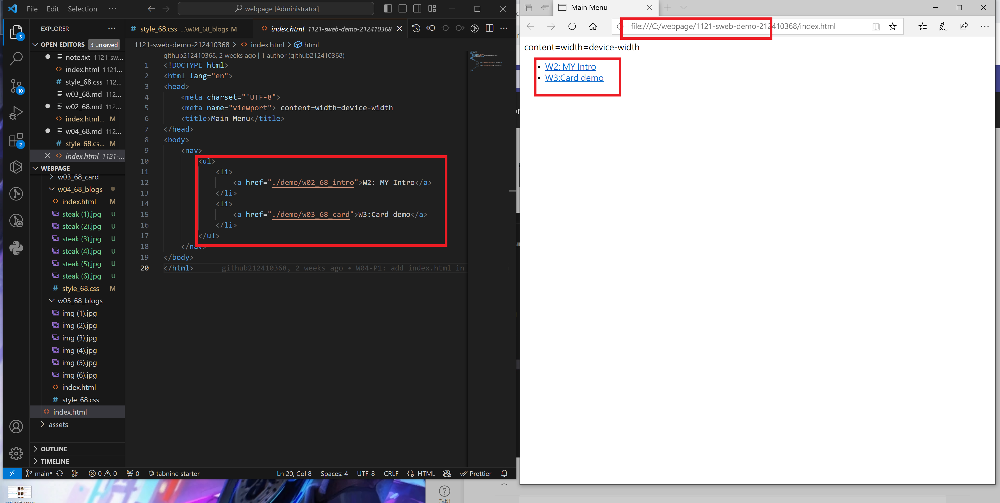
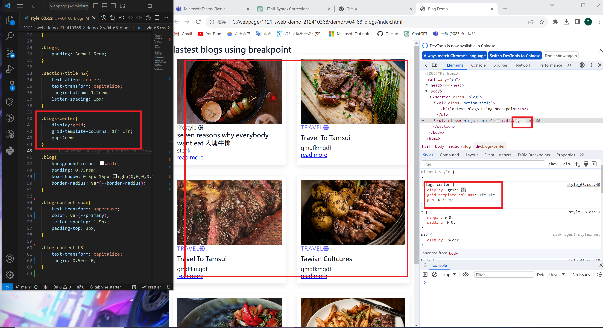
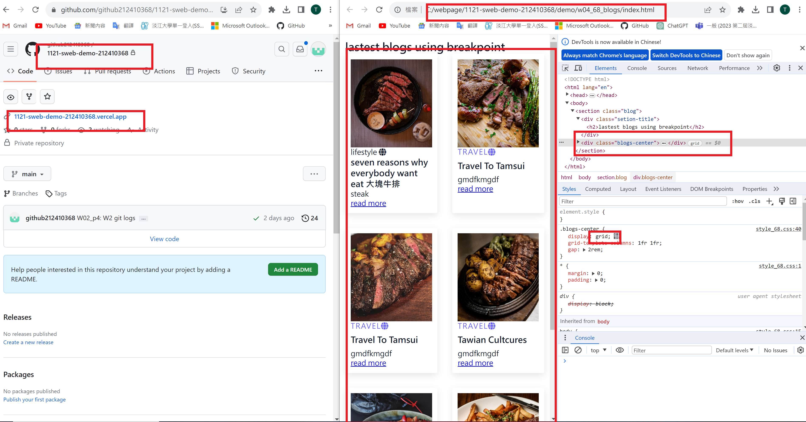
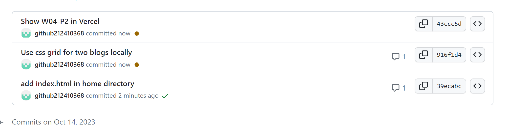

[my github repo URL](https://github.com/github212410368/1121-sweb-demo-212410368.git)

### W04-P1: add index.html in home directory

### W04-P2:Use css grid for two blogs locally

### W04-P3:Show W04-P2 in Vercel

### W04-P4: W4 git logs

---

git log --pretty=format:"%h%x09%an%x09%ad%x09%s" --after="2023-10-04"

---
