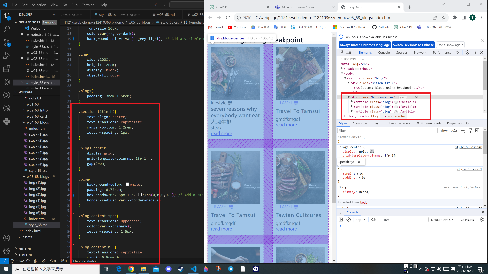
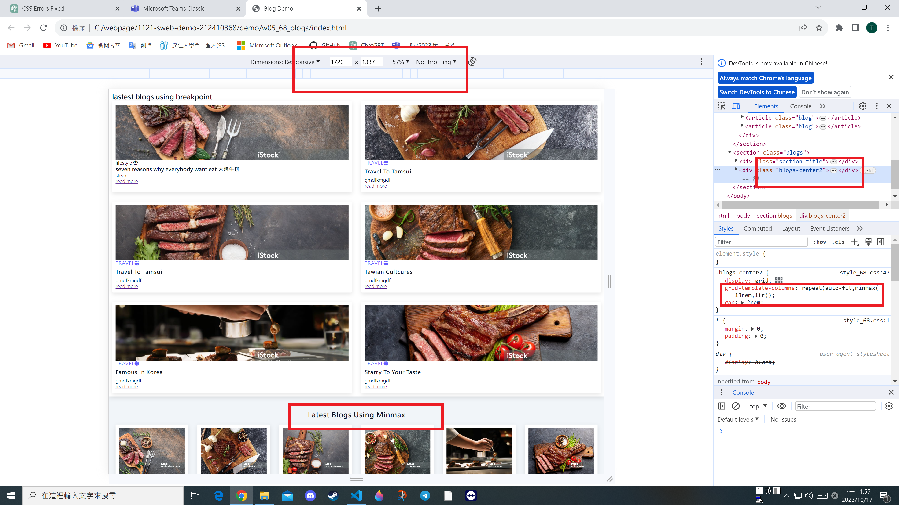

git config --global user.email"212410368@o365.tku.edu.tw"
git config --global user.name"212410368"

### W05-P1: Show 6 photos in css grid

### W05-P2: Use RWD breakpoints to show blogs
.png)
.png)
.png)
.png)
.png)

### W05-P3: RWD using minmax method, show 9 blogs

### W05-O4: W5 git logs