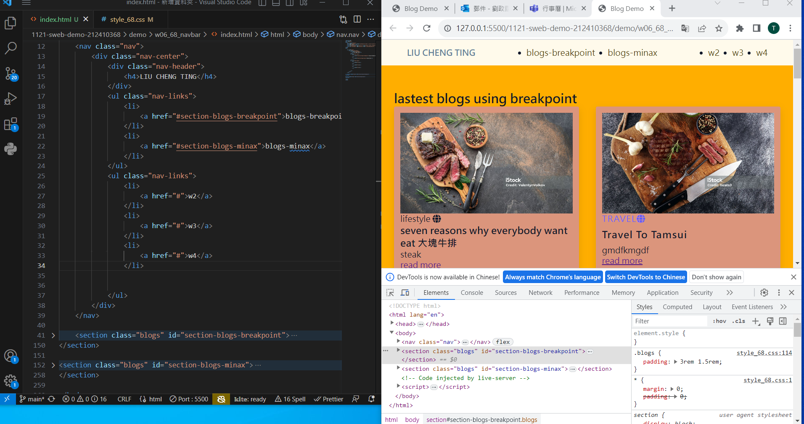
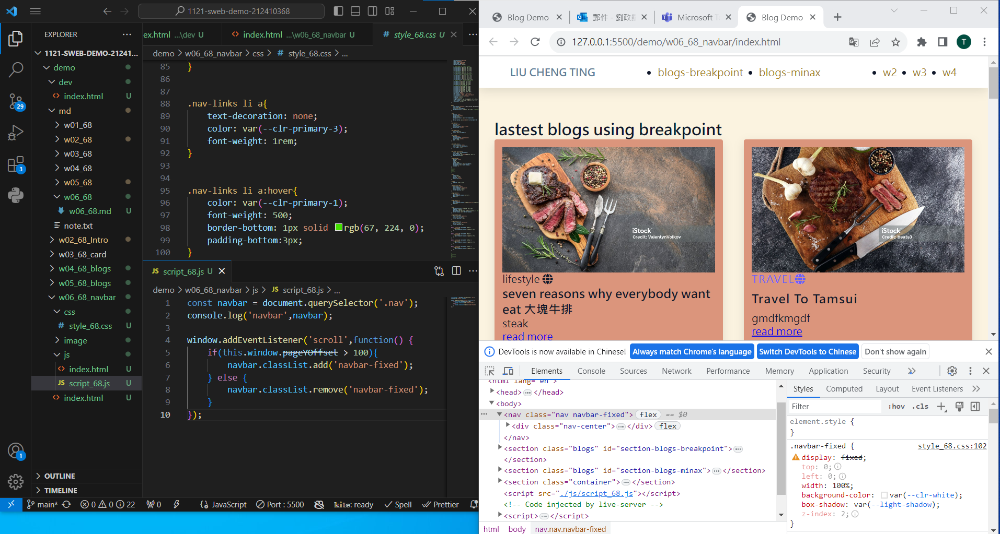
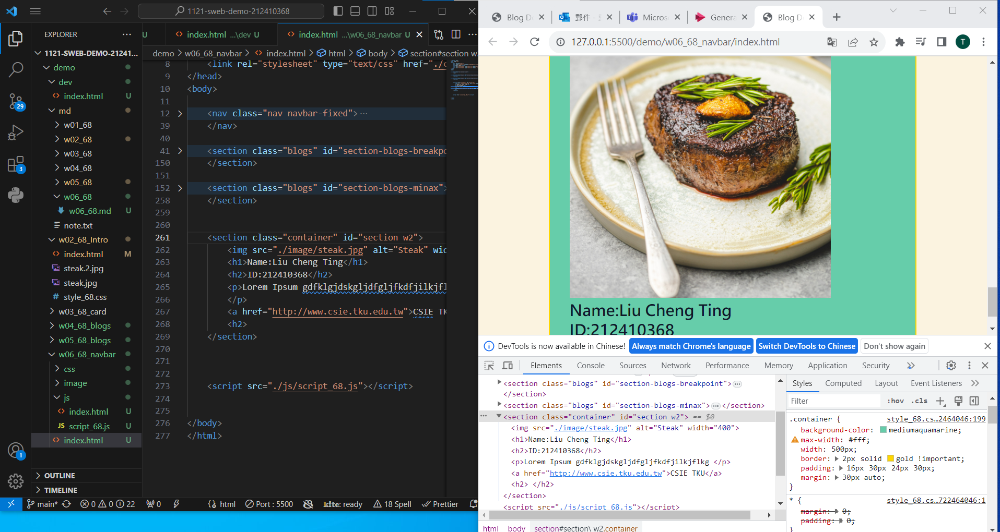

git config --global user.email"212410368@o365.tku.edu.tw"
git config --global user.name"212410368"

[my github repo URL](https://github.com/github212410368/1121-sweb-demo-212410368)
[my vercel URL](http://127.0.0.1:5500/dev/index.html)

### W06-P1: Navbar setup with two links to #section-blogs-breakpoints and #section-blogs-minmix

### W06-P2: Use js to control when to add or remove .navbar-fixed

### ### W06-P3: Show W2 My Introduction section when press the link W2

11

### W06-O4: W6 git logs

git log --pretty=format:"%h%x09%an%x09%ad%x09%s" --after="2023-10-18"

[Vercel]
