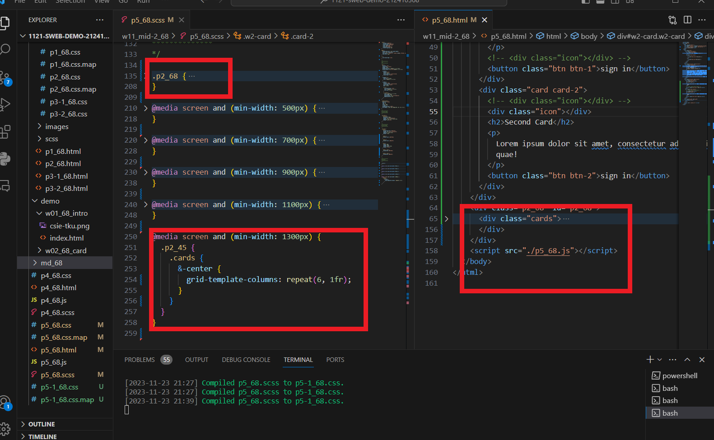
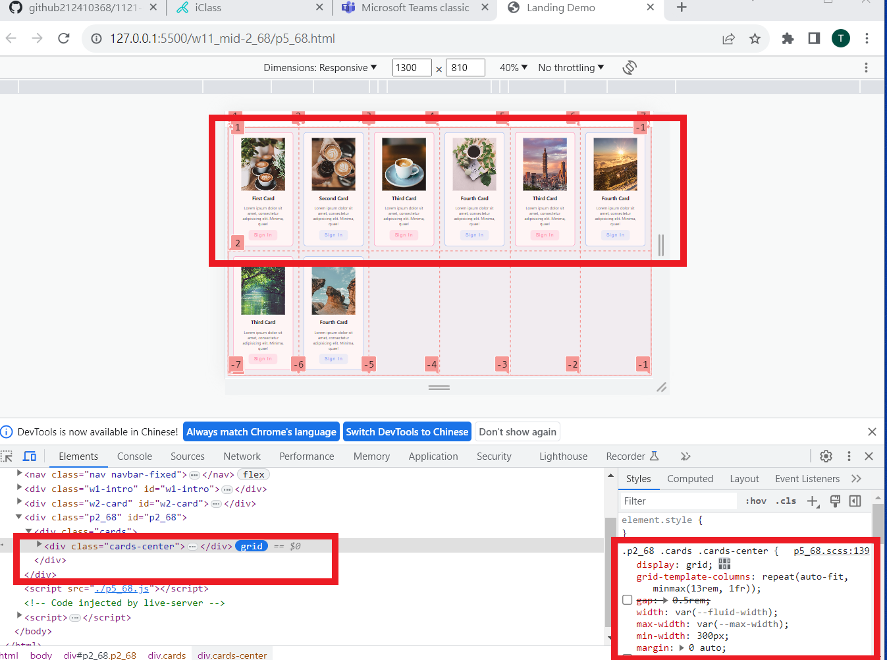
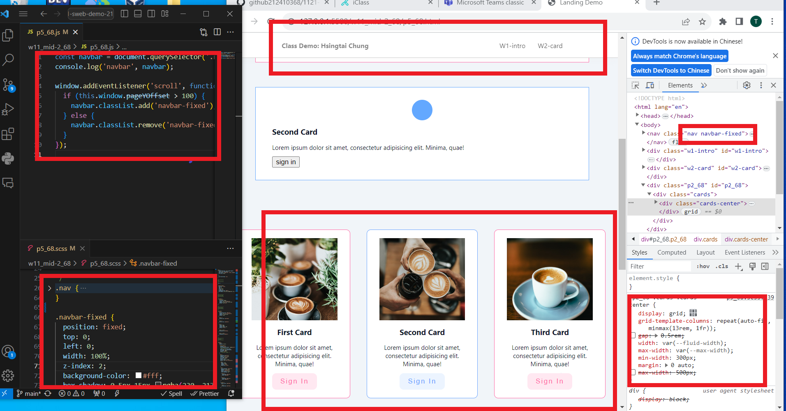
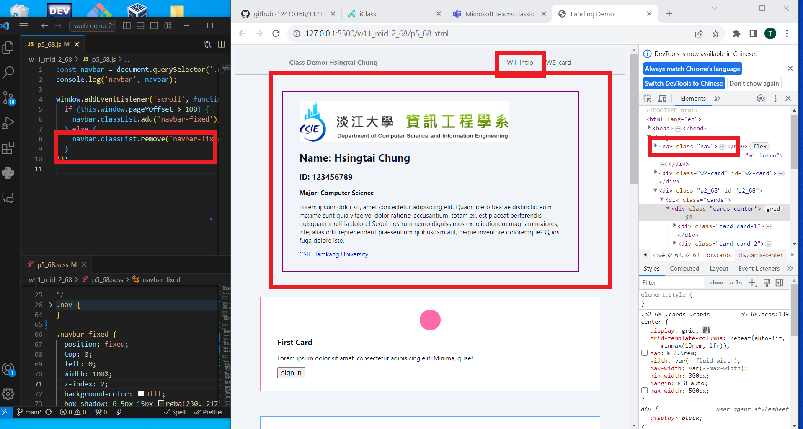

git config --global user.email "212410368@o365.tku.edu.tw"
git config --global user.name "212410368"

[my github repo URL](https://github.com/github212410368/1121-sweb-demo-212410368)
[my vercel URL](http://127.0.0.1:5500/dev/index.html)

git log --pretty=format:"%h%x09%an%x09%ad%x09%s" --after="2023-11-22"

### W11-P1: Use scss to finish p1_68


```
2229c44 212410368       Thu Nov 23 20:52:20 2023 +0800  W11-P1: Use scss to finish p1_68
```

### W11-P2: Use scss to finish p2_68 (responsive)


```
0fa7254 212410368       Thu Nov 23 21:01:22 2023 +0800  W11-P2: Use scss to finish p2_xx (responsive)
```

### W11-P3: Finish p5_68 by adding content in p2_68





```
0fd3456 212410368       Thu Nov 23 22:06:23 2023 +0800  W11-P3: Finish p5_68 by adding content in p2_68
```

### W11-P4: Finish p5_68 by implement fixed navbar





```

```
