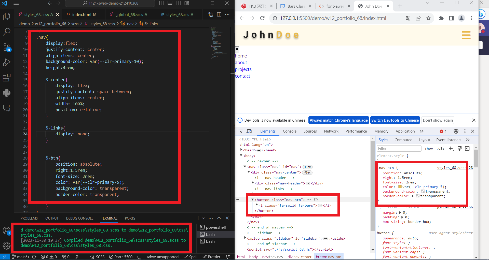
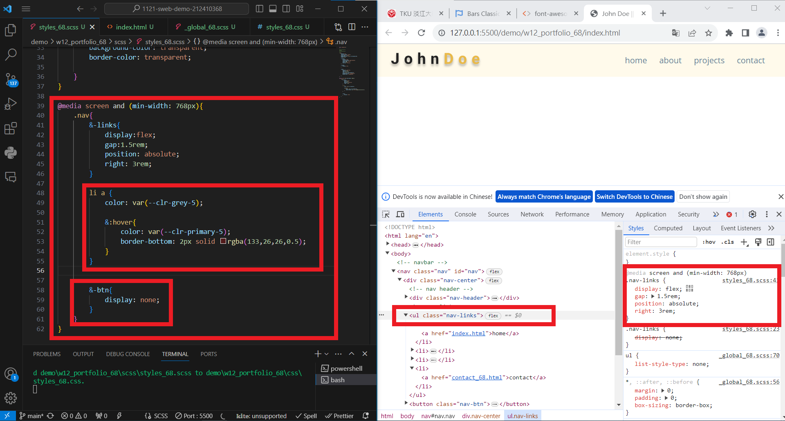

git config --global user.email "212410368@o365.tku.edu.tw"
git config --global user.name "212410368"

[my github repo URL](https://github.com/github212410368/1121-sweb-demo-212410368)
[my vercel URL](http://127.0.0.1:5500/dev/index.html)

git log --pretty=format:"%h%x09%an%x09%ad%x09%s" --after="2023-11-29"

### W12-P1: Create menu bar with nav links missing



```
3c99f05 212410368       Thu Nov 30 20:33:11 2023 +0800  W12-P1: Create menu bar with nav links missing
```

### W12-P2: Show nav-links when the screen is greater than 768px



```

```
