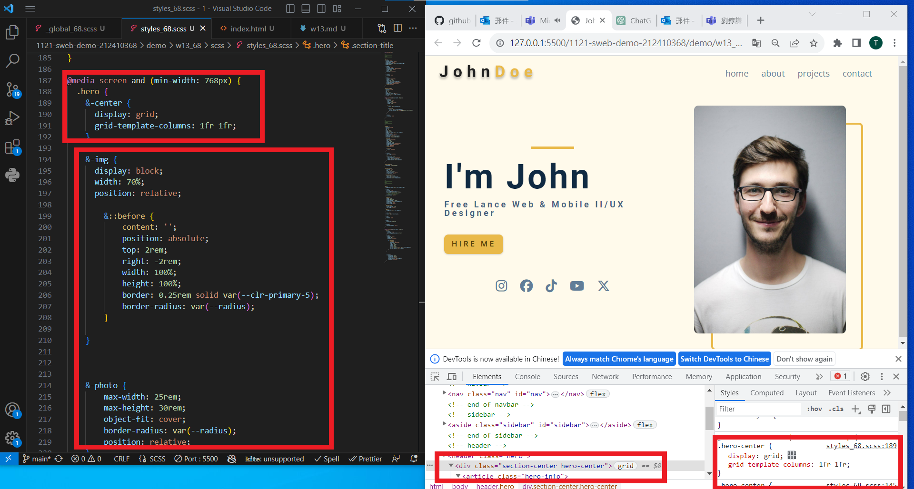
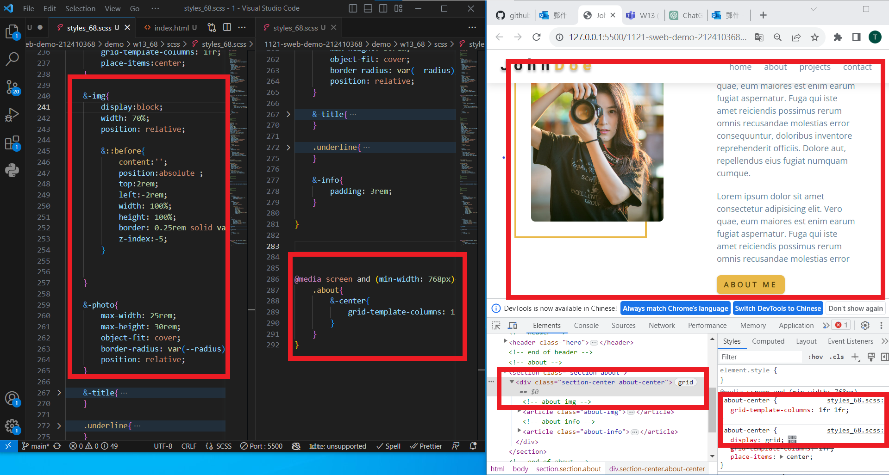
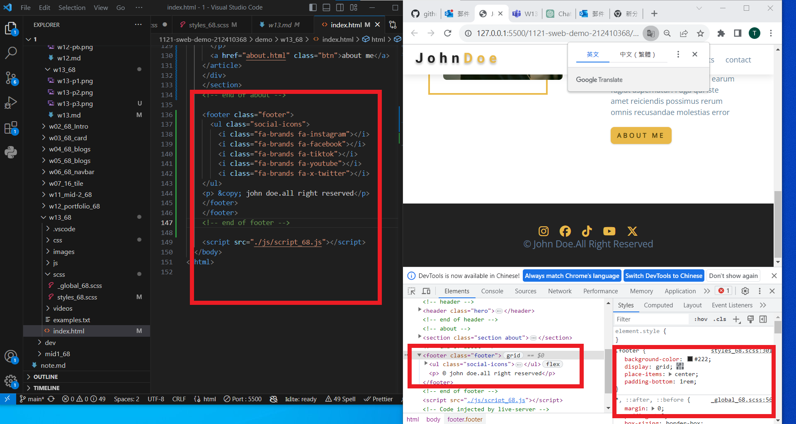

git config --global user.email "212410368@o365.tku.edu.tw"
git config --global user.name "212410368"

[my github repo URL](https://github.com/github212410368/1121-sweb-demo-212410368)
[my vercel URL](http://127.0.0.1:5500/dev/index.html)

git log --pretty=format:"%h%x09%an%x09%ad%x09%s" --after="2023-12-06"

### W13-P1: Do hero section using grid of 2 columns



```
5374ab6 212410368       Thu Dec 7 19:45:47 2023 +0800        W13-P1: Do hero section using grid of 2 columns
```

### W13-P2: Do about section



```
969c7cd 212410368       Thu Dec 7 19:47:26 2023 +0800        W13-P2: Do about section
```

### W13-P3: Do footer section



```
55ab6b4 212410368       Thu Dec 7 20:09:20 2023 +0800        W13-P3: Do footer section
```
