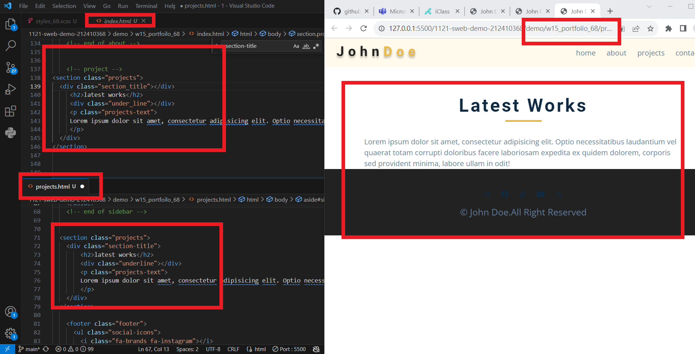
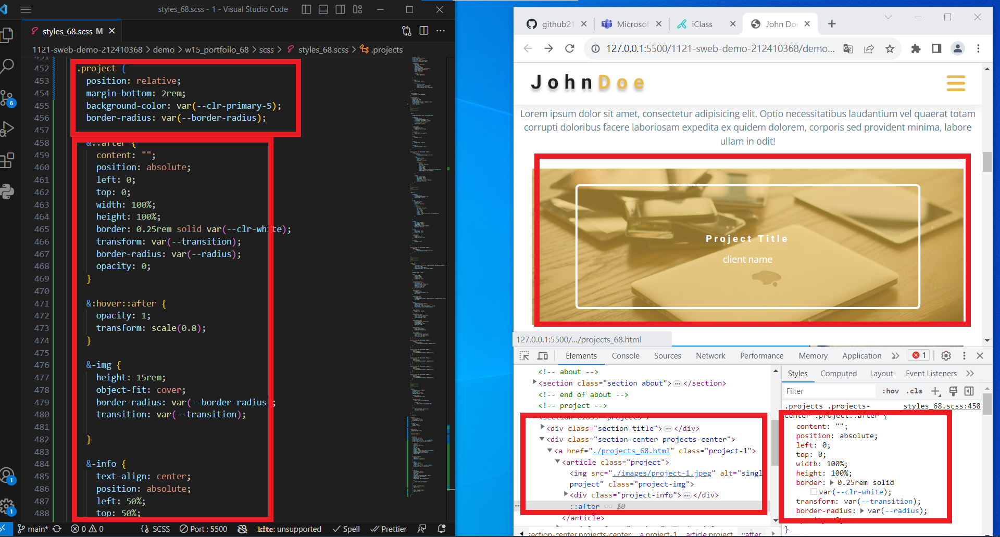
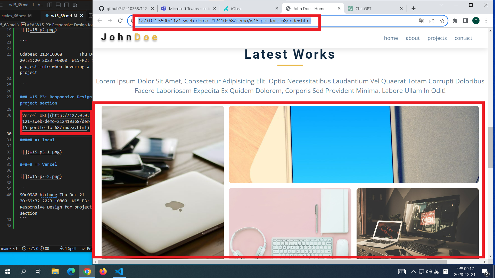
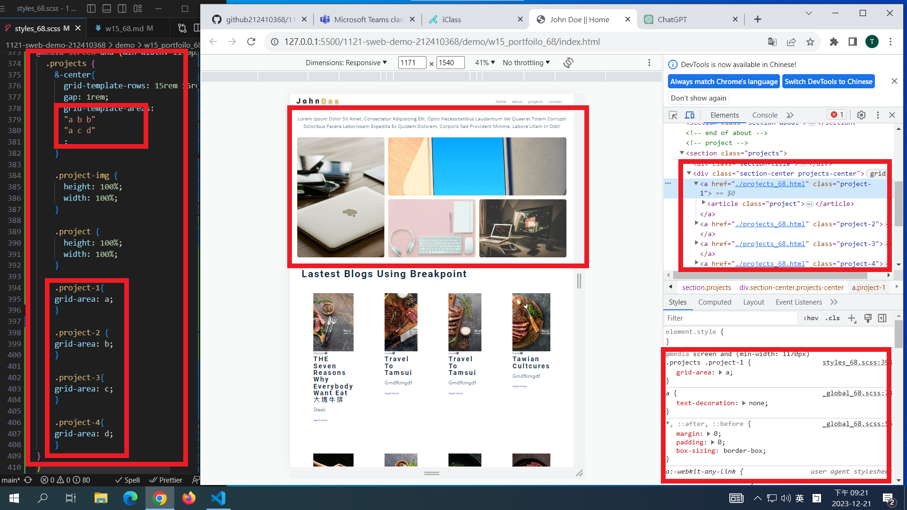

git config --global user.email "212410368@o365.tku.edu.tw"
git config --global user.name "212410368"

[my github repo URL](https://github.com/github212410368/1121-sweb-demo-212410368)
[my vercel URL](http://127.0.0.1:5500/dev/index.html)

git log --pretty=format:"%h%x09%an%x09%ad%x09%s" --after="2023-12-20"

### W15-P1: Create projects_xx.html with header, footer same as index.html, add projects title



```
46e5d4f 212410368       Thu Dec 21 19:15:24 2023 +0800   W15-P1: Create projects_xx.html with header, footer same as index.html, add projects title
```

### W15-P2: Show project-info when hovering a project



```

6dabeac 212410368       Thu Dec 21 20:31:20 2023 +0800  W15-P2: Show project-info when hovering a project

```

### W15-P3: Responsive Design for project section

[Vercel URL](http://127.0.0.1:5500/1121-sweb-demo-212410368/demo/w15_portfoilo_68/index.html)

##### => local



##### => Vercel



```
549a71b 212410368       Thu Dec 21 21:23:59 2023 +0800  W15-P3: Responsive Design for project section
```

### W15-P4: Git logs of W15


```
git log --pretty=format:"%h%x09%an%x09%ad%x09%s" --after="2023-12-20"

90c0980 htchung Thu Dec 21 20:59:32 2023 +0800  W15-P3: Responsive Design for project section
ae9997c htchung Thu Dec 21 20:09:06 2023 +0800  W15-P2: Show project-info when hovering a project
5f66e0e htchung Thu Dec 21 18:56:09 2023 +0800  W15-P1: Create projects_xx.html with header, footer same as index.html, add projects title
```
