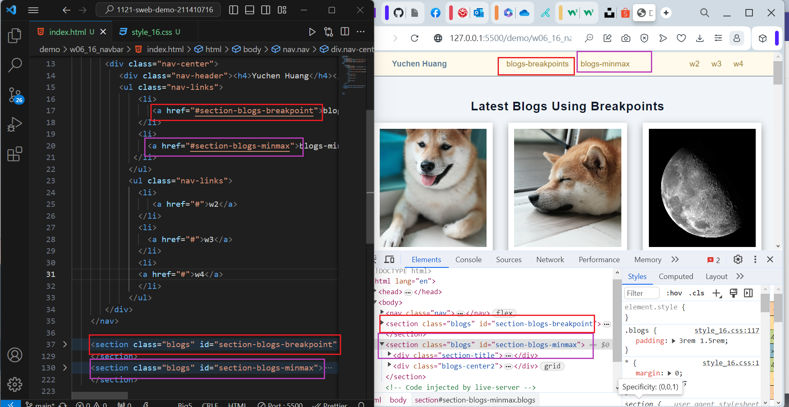
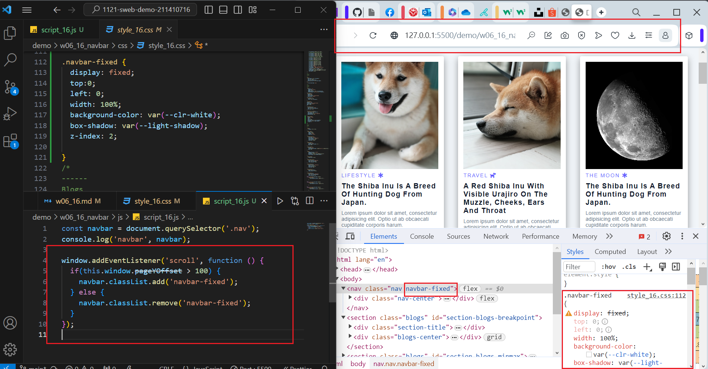
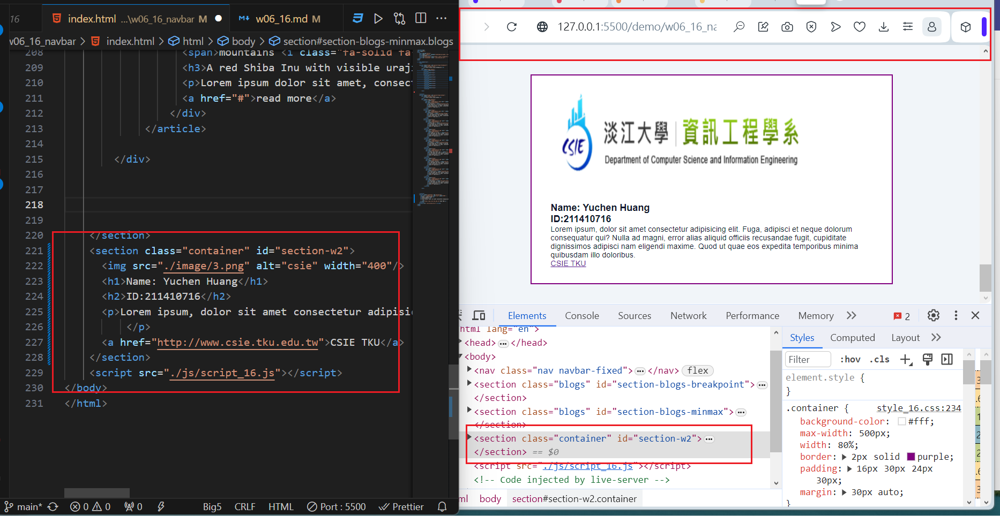

[My Github Repo URL](https://github.com/211410176/1121-sweb-demo-211410716.git)

[My Vercel URL](https://1121-sweb-demo-211410716.vercel.app)

### W06-P1: Navbar setup with two links to #section-blogs-breakpoints and #section-blogs-minmix



```
0536193 211410716       Fri Oct 20 21:35:28 2023 +0800  W06-P1: Navbar setup with two links to #section-blogs-breakpoints and #section-blogs-minmix
``` 
### W06-P2: Use js to control add or remove .navbar-fixed





```
dd3db48 211410716       Sun Oct 22 00:27:13 2023 +0800  W06-P2: Use js to control add or remove .navbar-fixed
```
### W06-P3: W06-P3: Show W2 My Introduction section when press the link W2




```
e9ce43e 211410716       Sun Oct 22 17:23:14 2023 +0800  W06-P3: Show W2 My Introduction section when press the link W2
```

### W06-P4: W6 git logs


```
git log --pretty=format:"%h%x09%an%x09%ad%x09%s" --after="2023-10-18"

1453b3f 211410716       Sun Oct 22 17:36:24 2023 +0800  W6 git logs
e9ce43e 211410716       Sun Oct 22 17:23:14 2023 +0800  W06-P3: Show W2 My Introduction section when press the link W2     
dd3db48 211410716       Sun Oct 22 00:27:13 2023 +0800  W06-P2: Use js to control add or remove .navbar-fixed
0536193 211410716       Fri Oct 20 21:35:28 2023 +0800  W06-P1: Navbar setup with two links to #section-blogs-breakpoints and #section-blogs-minmix
```